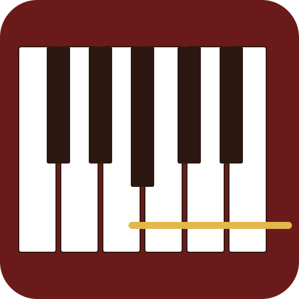
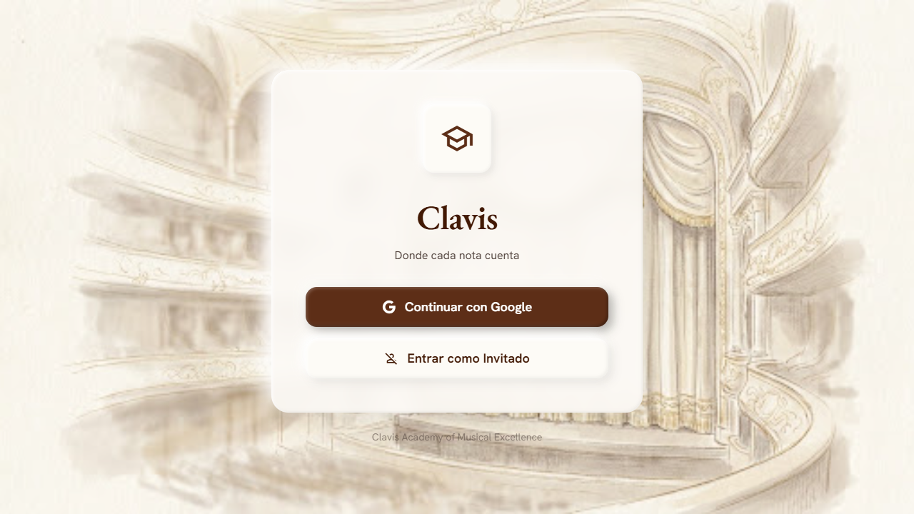

<p align="center">
  
</p>

<h1 align="center">Clavis</h1>

<p align="center">Aprende a leer partituras a primera vista. Aparece una nota en el pentagrama: identifícala y presiona la tecla correcta en tu teclado MIDI o en el piano en pantalla.</p>

<p align="center"><a href="https://opensource.org/licenses/MIT"></a></p>



## Características

### Entrenamiento

- **18 lecciones progresivas** — 9 en clave de sol + 9 en clave de fa, desde notas en líneas hasta el rango cromático completo.
- **Lecciones rápidas** — Sesiones personalizadas: elige clave, líneas/espacios, líneas adicionales, sostenidos, modo cronometrado y cantidad de notas (5/10/20). La configuración se guarda y se restaura al iniciar sesión.
- **Sistema de rachas** — Las respuestas correctas consecutivas acumulan una racha, con sonido de hito cada 5. La racha diaria se rastrea localmente o se sincroniza en la nube.
- **Ventana de recuperación** — Tras un error, presiona la tecla correcta para obtener crédito parcial antes del avance automático.
- **Modo cronometrado** — Cuenta regresiva por nota (5s u 8s según la duración de la sesión).
- **Notas fantasma** — Estela translúcida de las notas recientes; la última nota correcta aparece atenuada tras un error.
- **Hoja de ruta** — Progresión de lecciones con estados bloqueado/en curso/terminado por clave.
- **Frases del Sensei** — Reflexiones rotativas de Beethoven, Mozart, Bach, Chopin y más, sincronizadas entre dispositivos.

### Entrada y sonido

- **Entrada MIDI** — Conecta cualquier teclado USB/MIDI mediante la Web MIDI API, con detección automática.
- **Calibración MIDI** — Modal guiado (mantén 2s la nota más baja, luego la más alta); el rango se guarda y las notas fuera de él se aceptan por clase de tono.
- **Piano en pantalla** — Teclado 3D interactivo (teclas marfil/negro), rango completo C3–C6, reducido a 18 teclas desde C3 en móvil.
- **Barra de octavas** — Cambio manual de octava activable para teclados con rango limitado.
- **Síntesis Web Audio** — Cada nota se reproduce con osciladores en capas; arpegio mayor al acertar, menor al fallar, fanfarria al completar nivel.

### Visuales y plataforma

- **Diseño Claymorphism** — Tonos de arcilla cálida, tarjetas neumórficas, iconos Material Symbols y modo oscuro/claro que respeta `prefers-color-scheme`.
- **Pentagrama SVG** — Claves de sol y fa con fuente Noto Music, expresiones de nota (verde/rojo), gráfico semanal de precisión y modo silencioso.
- **Notación dual** — Alterna entre nombres americanos (C D E F G A B) y latinos (Do Re Mi Fa Sol La Si).
- **PWA instalable** — Funciona sin conexión con un service worker.
- **Sincronización en la nube** — Inicio de sesión con Google, historial de sesiones y configuración sincronizados a Firestore.
- **Respaldo en localStorage** — Todas las funciones principales funcionan sin Firebase.

## Primeros pasos

### Requisitos previos

- Node.js 18+
- npm 9+ (o yarn/pnpm)

### Instalación

```bash
git clone https://github.com/vruizdiaz10/piano.git
cd piano
npm install
```

### Variables de entorno

Crea un archivo `.env` en la raíz con tu configuración de Firebase:

```env
VITE_FIREBASE_API_KEY=your_api_key
VITE_FIREBASE_AUTH_DOMAIN=your_project.firebaseapp.com
VITE_FIREBASE_PROJECT_ID=your_project_id
VITE_FIREBASE_STORAGE_BUCKET=your_project.firebasestorage.app
VITE_FIREBASE_MESSAGING_SENDER_ID=your_sender_id
VITE_FIREBASE_APP_ID=your_app_id
```

> [!NOTE]
> La aplicación funciona **sin Firebase**: la autenticación y la sincronización en la nube son opcionales. Todo el progreso se guarda en `localStorage` por defecto.

### Desarrollo

```bash
npm run dev
```

Se abre en `http://localhost:5173` con reemplazo de módulos en caliente.

### Construcción

```bash
npm run build
npm run preview
```

La salida se genera en `dist/` y puede servirse con cualquier servidor de archivos estáticos.

## Cómo jugar

1. Inicia sesión con Google o entra como **invitado**.
2. Desde el **Dashboard**, elige una lección de la **hoja de ruta** o crea una **lección rápida** personalizada.
3. Suena una nota y aparece en el pentagrama.
4. Presiona la tecla correspondiente en tu teclado MIDI o haz clic en el piano en pantalla.
5. **Correcta**: el pentagrama parpadea en verde y suena un arpegio mayor.
6. **Incorrecta**: parpadeo rojo, se muestra la respuesta correcta con un consejo de error y se inicia la ventana de recuperación.
7. Al completar la sesión, la pantalla de **Resultados** muestra puntaje, precisión, mejor racha y calificación por estrellas. Elige **Reintentar**, **Siguiente** o volver al **Dashboard**.

### Calibración MIDI

La primera vez que conectes un teclado MIDI (si no hay rango guardado) se abre el modal de calibración:

1. Mantén presionada tu nota más baja durante 2 segundos.
2. Mantén presionada tu nota más alta durante 2 segundos.
3. El rango se guarda en la nube. También puedes recalibrar desde **Perfil → Calibrar controlador**.

## Atajos de teclado

| Tecla | Acción |
|-------|--------|
| `R` | Reiniciar el juego actual |
| `P` | Pausar / reanudar |
| `Space` | Saltar a la siguiente nota (durante la retroalimentación) |
| `Escape` | Cerrar superposición de pausa / modal de calibración |

Los atajos se desactivan cuando el foco está en un elemento de entrada o selección.

## Lecciones

### Clave de sol

| # | Lección | Rango |
|---|---------|-------|
| 1–3 | Líneas → Espacios → Líneas + espacios | E4–G5 |
| 4–6 | Pentagrama completo → Debajo → Encima | C4–C6 |
| 7–9 | Naturales → Sostenidos → Todas las notas | C4–C6 |

### Clave de fa

| # | Lección | Rango |
|---|---------|-------|
| 10–12 | Líneas → Espacios → Líneas + espacios | G2–B3 |
| 13–15 | Pentagrama completo → Debajo → Encima | C2–E4 |
| 16–18 | Naturales → Sostenidos → Todas las notas | C2–E4 |

## Stack tecnológico

| Tecnología | Propósito |
|---|---|
| [React 18](https://react.dev) + [TypeScript](https://www.typescriptlang.org) | Interfaz y tipos |
| [Vite](https://vitejs.dev) | Servidor de desarrollo y build |
| [Tailwind CSS](https://tailwindcss.com) | Estilos utility-first |
| [Radix UI](https://www.radix-ui.com) + [shadcn/ui](https://ui.shadcn.com) | Primitivas accesibles y patrones de componentes |
| [Firebase](https://firebase.google.com) | Auth + sincronización con Firestore |
| [Web Audio API](https://developer.mozilla.org/en-US/docs/Web/API/Web_Audio_API) | Síntesis de sonido |
| [Web MIDI API](https://developer.mozilla.org/en-US/docs/Web/API/Web_MIDI_API) | Entrada de teclado MIDI |
| [Noto Music](https://fonts.google.com/noto/specimen/Noto+Music) · [Material Symbols](https://fonts.google.com/icons) · [Hanken Grotesk](https://fonts.google.com/specimen/Hanken+Grotesk) · [EB Garamond](https://fonts.google.com/specimen/EB+Garamond) | Tipografía e iconos |

## Estructura del proyecto

```
src/
├── main.tsx / App.tsx          # Entrada de React, enrutado y orquestación del juego
├── hooks/                      # useGameState, useMidi, useSound, useAuth, sincronización…
├── screens/                    # Inicio, Dashboard, Biblioteca, Perfil, Resultados
├── data/                       # 18 lecciones (lessons.ts) y frases del Sensei
├── components/                 # Staff (pentagrama SVG), PianoKeyboard, Feedback, Toolbar…
├── utils/                      # Notación, análisis de errores, estadísticas, historial
└── types/                      # Tipos compartidos del juego
```
